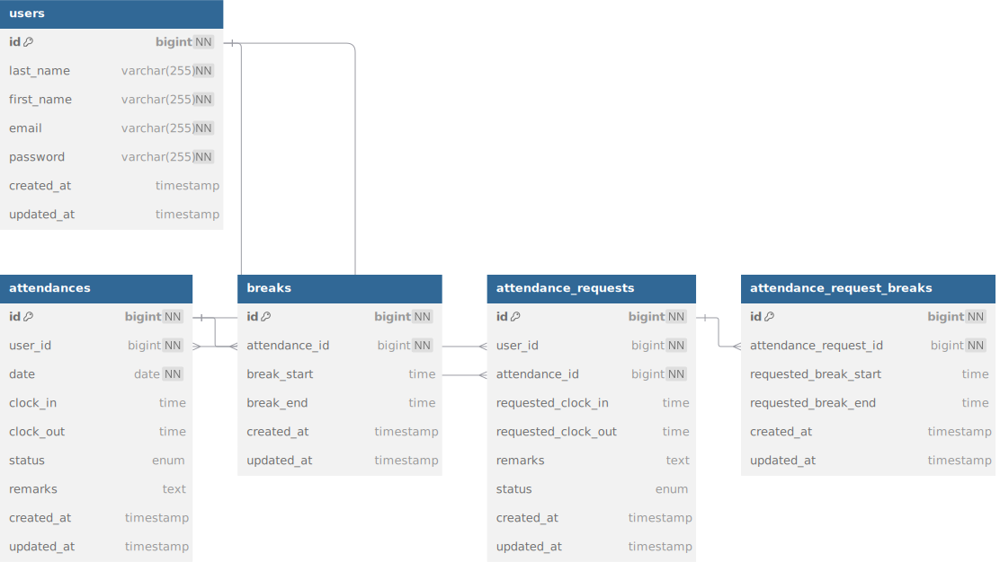

# attendance-manegement(勤怠管理)  


## 環境構築  


**Dockerビルド**  

  1.GitHub からクローン  

    `git@github.com:Blue1127n/attendance-manegement.git`   

  2.プロジェクトディレクトリに移動  

    `cd attendance-manegement`  

  3.リモートURLを変更  

    `git remote set-url origin <新しいリポジトリURL>`  

  4.初回のmainブランチをプッシュ  

    `git push origin main`  

  5.DockerDesktopアプリを立ち上げる  

    `docker-compose up -d --build`  
    `code .`  


**Laravel環境構築**  

  1.PHPコンテナ内にログイン  

    `docker-compose exec php bash`  

  2.インストール  

    `composer install`  

  3.「.env」ファイルを作成  

    `cp .env.example .env`  

  4..envに以下の環境変数に変更  

    ``` text  
    DB_CONNECTION=mysql
    DB_HOST=mysql
    DB_PORT=3306
    DB_DATABASE=laravel_db
    DB_USERNAME=laravel_user
    DB_PASSWORD=laravel_pass
    ```  

  5.アプリケーションキーの作成  

    `php artisan key:generate`  

  6.マイグレーションの実行  

    `php artisan migrate`  

  7.シーディングの実行  

    `php artisan db:seed`  


**MailHog環境構築**  

  1.docker-compose.ymlに追加  
    注意：他のサービス（php, nginx, mysqlなど）と同じインデント階層に追加  

    ``` text  
    services:
      mailhog:
        image: mailhog/mailhog
        ports:
          - "1025:1025"
          - "8025:8025"
    ```  

  2.MailHogのセットアップ  

    `docker-compose up -d mailhog`  

  3.「.env」の設定  

    ``` text  
    MAIL_MAILER=smtp
    MAIL_HOST=mailhog
    MAIL_PORT=1025
    MAIL_USERNAME=null
    MAIL_PASSWORD=null
    MAIL_ENCRYPTION=null
    MAIL_FROM_ADDRESS="noreply@example.com"
    MAIL_FROM_NAME="勤怠管理"
    ```  

  4.キャッシュクリア  

    `php artisan config:clear`  
    `php artisan cache:clear`  
    `php artisan serve`  
    `docker-compose restart

以下のリンクは認証メールの遷移先です。<br>
- http://localhost:8025/


## テーブル仕様

### usersテーブル
| カラム名 | 型 | primary key | unique key | not null | foreign key |
| --- | --- | --- | --- | --- | --- |
| id | bigint | ◯ |  | ◯ |  |
| last_name | varchar(255) |  |  | ◯ |  |
| first_name | varchar(255) |  |  | ◯ |  |
| email | varchar(255) |  | ◯ | ◯ |  |
| password | varchar(255) |  |  | ◯ |  |
| created_at | timestamp |  |  |  |  |
| updated_at | timestamp |  |  |  |  |

### attendancesテーブル
| カラム名 | 型 | primary key | unique key | not null | foreign key |
| --- | --- | --- | --- | --- | --- |
| id | bigint | ◯ |  | ◯ |  |
| user_id | bigint | ◯ |  | ◯ | users(id) |
| date | date |  |  | ◯ |  |
| clock_in | time |  |  |  |  |
| clock_out | time |  |  |  |  |
| status | enum |  |  |  |  |
| remarks | text |  |  |  |  |
| created_at | timestamp |  |  |  |  |
| updated_at | timestamp |  |  |  |  |

### breaksテーブル
| カラム名 | 型 | primary key | unique key | not null | foreign key |
| --- | --- | --- | --- | --- | --- |
| id | bigint | ◯ |  | ◯ |  |
| attendance_id | bigint | ◯ |  | ◯ | attendances(id) |
| break_start | time |  |  |  |  |
| break_end | time |  |  |  |  |
| created_at | timestamp |  |  |  |  |
| updated_at | timestamp |  |  |  |  |

### attendance_requestsテーブル
| カラム名 | 型 | primary key | unique key | not null | foreign key |
| --- | --- | --- | --- | --- | --- |
| id | bigint | ◯ |  | ◯ |  |
| user_id | bigint | ◯ |  | ◯ | users(id) |
| attendance_id | bigint | ◯ |  | ◯ | attendances(id) |
| requested_clock_in | time |  |  |  |  |
| requested_clock_out | time |  |  |  |  |
| remarks | text |  |  |  |  |
| status | enum |  |  |  |  |
| created_at | timestamp |  |  |  |  |
| updated_at | timestamp |  |  |  |  |

### attendance_request_breaksテーブル
| カラム名 | 型 | primary key | unique key | not null | foreign key |
| --- | --- | --- | --- | --- | --- |
| id | bigint | ◯ |  | ◯ |  |
| attendance_request_id | bigint | ◯ |  | ◯ | attendancerequests(id) |
| requested_break_start | time |  |  |  |  |
| requested_break_end | time |  |  |  |  |
| created_at | timestamp |  |  |  |  |
| updated_at | timestamp |  |  |  |  |


## 使用技術(実行環境)  

- PHP8.3.11  
- Laravel8.83.8  
- MySQL8.0.26  


## ER図  

  

## テストアカウント  

last_name: 管理者  
first_name: ユーザー  
email: admin@example.com  
password: password123  
-------------------------
last_name: 一般  
first_name: ユーザー1  
email: user1@example.com  
password: password234  
-------------------------
last_name: 一般  
first_name: ユーザー2  
email: user1@example.com  
password: password234  
-------------------------
last_name: 一般  
first_name: ユーザー3  
email: user1@example.com  
password: password345  
-------------------------
last_name: 一般  
first_name: ユーザー4  
email: user1@example.com  
password: password456  
-------------------------
last_name: 一般  
first_name: ユーザー5  
email: user1@example.com  
password: password567  
-------------------------


## PHPUnitを利用したテストの環境構築と確認

以下のコマンド:  
```
//テスト用データベースの作成
docker-compose exec mysql bash
mysql -u root -p

//パスワードはrootと入力
CREATE DATABASE demo_test;
SHOW DATABASES;

//configファイルのdatabase.phpの追加変更
'mysql_test' => [
            'driver' => 'mysql',
            'url' => env('DATABASE_URL'),
            'host' => env('DB_HOST', '127.0.0.1'),
            'port' => env('DB_PORT', '3306'),
            'database' => 'demo_test',
            'username' => 'root',
            'password' => 'root',
            'unix_socket' => env('DB_SOCKET', ''),
            'charset' => 'utf8mb4',
            'collation' => 'utf8mb4_unicode_ci',
            'prefix' => '',
            'prefix_indexes' => true,
            'strict' => true,
            'engine' => null,
            'options' => extension_loaded('pdo_mysql') ? array_filter([
                PDO::MYSQL_ATTR_SSL_CA => env('MYSQL_ATTR_SSL_CA'),
            ]) : [],
        ],

//テスト用の.envファイル作成
cp .env .env.testing

//.env.testingファイルのAPP_ENVとAPP_KEYの編集
APP_NAME=Laravel
APP_ENV=test
APP_KEY=
APP_DEBUG=true
APP_URL=http://localhost

docker-compose exec php bash
php artisan key:generate --env=testing
php artisan config:clear
php artisan migrate:fresh --env=testing

//phpunitのDB_CONNECTIONとDB_DATABASEのの編集
<php>
        <server name="APP_ENV" value="testing"/>
        <server name="BCRYPT_ROUNDS" value="4"/>
        <server name="CACHE_DRIVER" value="array"/>
        <!-- <server name="DB_CONNECTION" value="sqlite"/> -->
        <!-- <server name="DB_DATABASE" value=":memory:"/> -->
        <server name="DB_CONNECTION" value="mysql_test"/>
        <server name="DB_DATABASE" value="demo_test"/>
        <server name="MAIL_MAILER" value="array"/>
        <server name="QUEUE_CONNECTION" value="sync"/>
        <server name="SESSION_DRIVER" value="array"/>
        <server name="TELESCOPE_ENABLED" value="false"/>
    </php>

//テストの実行
./vendor/bin/phpunit
```


## URL  

- 開発環境：http://localhost/  
- phpMyAdmin:：http://localhost:8080/  


## 機能要件で別途追加したこと  

- 会員登録画面（一般）  
  エラーメッセージ表示機能:姓と名の間にスペースがない場合に以下のメッセージ表示  
  「姓と名の間にスペースを入れて入力してください」  

  エラーメッセージ表示機能:メールアドレスの形式が正しくない場合に以下のメッセージ表示  
  「メールアドレスの形式が正しくありません」


- ログイン画面（管理者・一般）  
  エラーメッセージ表示機能:メールアドレスの形式が正しくない場合に以下のメッセージ表示  
  「メールアドレスの形式が正しくありません」

  エラーメッセージ表示機能:パスワードの入力規則違反の場合に以下のメッセージ表示  
  「パスワードは8文字以上で入力してください」

- 勤怠詳細画面（管理者・一般）  
  エラーメッセージ表示機能:休憩開始時間が休憩終了時間より後になっている場合に以下のメッセージを表示  
  「休憩時間が不適切な値です」  

- PHPUnitを利用したテスト変更点  
  ID:11 勤怠詳細情報修正機能（一般）  
  テスト内容:休憩開始時間が退勤時間より後になっている場合、エラーメッセージが表示される  
  期待挙動:「出勤時間もしくは退勤時間が不適切な値です」というバリデーションメッセージが表示される  
  変更内容:「出勤時間もしくは退勤時間が不適切な値です」→「休憩時間が勤務時間外です」

  ID:13 勤怠詳細情報取得・修正機能（管理者）  
  テスト内容:休憩開始時間が退勤時間より後になっている場合、エラーメッセージが表示される  
  期待挙動:「出勤時間もしくは退勤時間が不適切な値です」というバリデーションメッセージが表示される  
  変更内容:「出勤時間もしくは退勤時間が不適切な値です」→「休憩時間が勤務時間外です」


